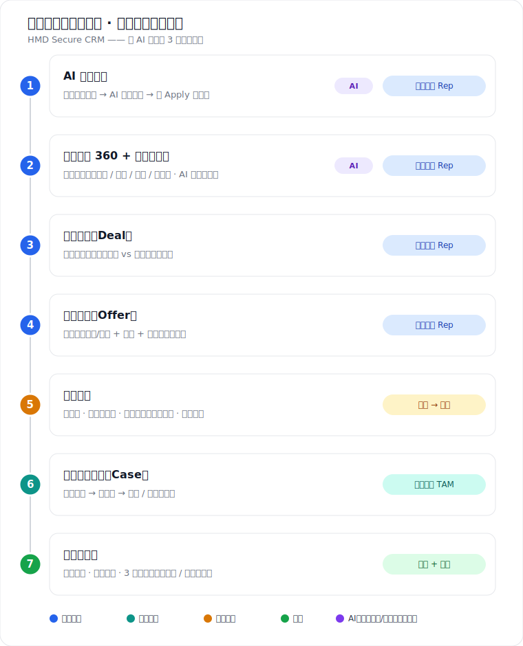

# 这个项目到底在做什么（写给零商业基础的人）

> 一页讲清楚：我们在解决什么、谁在用、每个功能干嘛、有什么用。用程序员熟悉的东西类比。

## 一句话

给一家**卖设备的公司**做一套"**管客户和生意的中央系统**"。这类系统行话叫 **CRM**（客户关系管理系统）。

> CRM 之于销售团队 ≈ **GitHub + Jira 之于开发团队**。
> 开发团队没有 git/issue，代码靠邮件互发、bug 记脑子里——一团乱。销售团队没有 CRM，客户、生意、报价全在**邮件 + Excel + 个人记事本**里，同样一团乱。我们来当这个"中央真相源"。

## 客户是谁、痛在哪

**HMD Secure**：成立一年的创业公司，卖**安全设备**（加密手机、加固平板）+ **服务**（设备管理、技术支持、合规审计）给**大企业**。

| 之前（痛点） | 之后（我们做的） |
|---|---|
| 客户信息散落邮件/Excel | 一个系统，全部集中 |
| 老板不知道有哪些生意、进展如何 | 仪表盘一眼看全管道 + 哪些卡住 |
| 财务完全没法预测收入 | 3 年按季度的收入预测，自动算 |
| 客户报障没状态没记录 | 工单有状态有历史，新人能查 |
| 干活像无脑录数据 | AI 帮录入 + 提建议，像有个分析师 |

## 受众：4 种角色，各有各的首页

| 角色 | 商业岗位 | 程序员类比 | 关心啥 |
|---|---|---|---|
| **Sofia** | 销售代表(Rep) | feature owner，把一单生意从线索推到成交 | 我的客户/生意/报价审批 |
| **Timo** | 技术客户经理(TAM) | on-call 支持工程师 | 分给我的报障工单、客户历史 |
| **Mira** | 销售经理(SM) | 研发 manager，看团队全局、审 PR | 团队管道、卡住的生意、审折扣 |
| **Fiona** | 财务(Finance) | 预算负责人 | 价目表、大折扣审批、收入预测 |

> 这 4 个是种子数据里的假用户；演示靠 `/role-switch` 切角色，展示"同一套数据，不同人不同视图"。

## 一单生意的生命周期

## 业务概念速查（术语 → 大白话 → 程序员类比）

| 术语 | 大白话 | 程序员类比 |
|---|---|---|
| Account 客户 | 一个客户公司的档案页（产品中心） | 一个 repo 主页 |
| Contact 联系人 | 客户公司里的对接人 | — |
| Deal 商机 | 一笔进行中、还没成交的买卖 | 还没 merge 的 PR |
| Pipeline / Stage 漏斗/阶段 | 生意经历的步骤：感兴趣→询价→报价→客户测试→合同谈判→赢/丢 | 状态机 / kanban 列 |
| Direct vs Reseller 直销/经销商 | 直接卖给客户 vs 通过中间商卖（经销商不走"合同谈判"） | 两条不同的流程分支 |
| Catalog 目录 | 产品和服务的价目表（财务上下架/改价/退役） | 商品菜单 / 定价表 |
| Offer 报价单 | 给客户的正式报价：选品 + 数量 + 折扣 | 自动生成的 invoice |
| 折扣审批流 | 给折扣要签字：需理由 → 经理批 → 财务批；审批期锁定 | code review + 需 senior 审批才能 merge；冻结的 PR |
| Case 工单 | 客户报的一个问题，TAM 处理（状态/优先级/笔记） | 一个 GitHub issue |
| Forecast 预测 | 猜未来能收多少钱（3 年、按季度、加权） | 期望值 Σ(金额×概率) + 置信区间 |
| Activity 时间线 | 客户身上发生过的所有事的流水 | git log / 审计日志 |
| Notification 通知 | 站内消息（如"有报价单要你审批"） | GitHub 通知铃铛 |

**"加权预测"再拆一下**：大客户分几年陆续买（**时间分段**，铺成 12 个季度）；每笔金额 ×成交概率（**加权**，70% 阶段的单子算 70%）；**设备钱**（一次性）和**服务钱**（按月续费）性质不同，**分开列**。

## 3 个 AI 亮点（比赛靠这个赢）

让 CRM"像个分析师，而不是录入工具"：

1. **AI 智能录入**：粘贴乱糟糟的客户邮件 → AI 抽成结构化草稿（联系人/商机/工单/待办）→ 人确认后才写库。*类比：AI 把自由文本 bug 报告变成规整 issue，但你审核后才创建。*
2. **下一步最佳行动(NBA)**：AI 读完客户历史，告诉你接下来该干嘛 + 拟好的邮件。*类比：AI 读完 issue 讨论，建议下一步 + 回复草稿。*
3. **3 年加权预测**：上面那个，AI 还能用一段话总结。

> **安全设计**：AI 只出草稿/建议，绝不偷偷改数据，必须人点确认；没网/没 key 有规则兜底，演示不挂。

## 真正的受众其实是评委

这是个**黑客松（创意比赛）**。终极受众是 **HMD 的评委**。要在 **3 分钟 demo**（见 `demo/script.md`）里让他们相信"这正好解决了 HMD brief 里的痛点"。那条 7 步演示路线，就是把上面这套价值故事按最有冲击力的顺序演一遍。

- **线上地址**：http://wichai.xyz:3000
- **完整业务规格**：`/BUILD-SPEC.md` · **演示叙事**：`memory/pitch-spec.md` · **逐镜脚本**：`demo/script.md`
